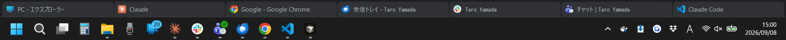
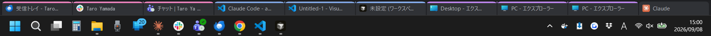
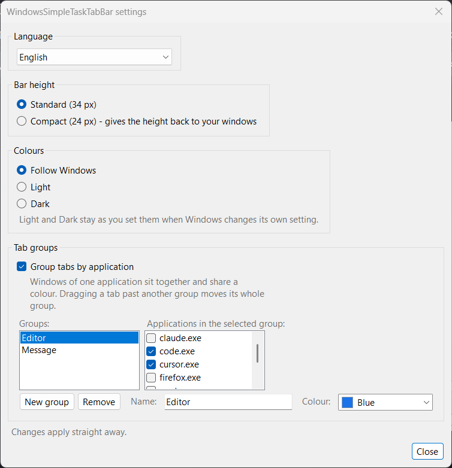

# windows-simple-tasktabbar

[English version](README.md)

タスクバーの上に横一列の常駐バーを表示し、起動中のウィンドウを Chrome 風のタブとして並べる
Windows アプリです。

複数のウィンドウを1つの枠に取り込む（統合する）機能は**ありません**。表示と切り替えだけを
担当します。



## 目的

Windows は、前面にないアプリが自分を前面へ出すことを制限しています。この制限のため、
切り替えたいウィンドウが後ろに残り、タスクバーのボタンが点滅するだけで切り替わらないことが
あります。本アプリは3段階の前面化処理でこれを解決します。詳しくは
「[前面化を確実にする仕組み](#前面化を確実にする仕組み)」を参照してください。

## 動作

- **タブをクリック** — そのウィンドウを前面に出します。最小化されていれば元に戻します。
- **前面にあるタブをクリック** — 最小化します（タスクバーと同じ動きです）。
- **× をクリック、または中クリック** — そのウィンドウを閉じます。
- **タブを横にドラッグ** — 位置を入れ替えます。通り過ぎたタブは自動でずれます。Esc で
  取りやめ、両端に押し当てると横スクロールします。グループ化が有効なときは、同じグループの
  中で動かせます。隣のグループの向こうまで引くと、グループごと移動します。ウィンドウが
  1つだけのアプリは、単体で移動します。
- **タブの上で右クリック** — 閉じる・ほかのタブを閉じる・左側のタブを閉じる・
  右側のタブを閉じる・最小化のメニューを表示します。
- **タブのない場所で右クリック** — 設定・再読み込み・終了のメニューを表示します。
- **バーの上でホイールを回す、または両端の矢印をクリック** — タブが入りきらないときに
  横へ動かします。切り替えたウィンドウのタブも自動で見える位置に来ます。
- **アプリ単位でタブをまとめる** — 設定で切り替えます。同じアプリのウィンドウが隣り合って
  並び、タブの上端に共通の色が付きます。グループの境目には区切り線が入ります。新しく開いた
  ウィンドウは行の末尾ではなく、同じアプリの隣に入ります。複数のアプリを1つのグループに
  まとめ、名前と色を指定することもできます。初期状態では無効です。
- ウィンドウの増減、切り替え、タイトル変更を検知して自動更新します。保険として2秒ごとにも
  更新します。
- **配色を選ぶ** — 設定で切り替えます。Windows に従う、常に明るい、常に暗い、の3つです。
  初期状態は Windows に従う設定で、Windows 側が切り替わった直後に描き直します。時刻で
  自動的に切り替わる設定にも追従します。明るい・暗いを選んだ場合は、そのままの配色を保ちます。
- **新しい版の確認** — 起動時に新しい版が出ていないかを確認し、出ていればお知らせします。
  ダウンロードは行いません。「[更新の確認](#更新の確認)」を参照してください。

- **表示言語を選ぶ** — 設定で切り替えます。Windows に従うほか、12言語から選べます。英語・
  日本語・簡体字中国語・繁体字中国語・ロシア語・ドイツ語・フランス語・スペイン語・
  ポルトガル語（ブラジル）・韓国語・ポーランド語・イタリア語です。初期状態は Windows に従う
  設定で、12言語に当てはまらない表示言語では英語になります。書体も言語に合わせて変わります。
  中国語・日本語・韓国語はそれぞれ専用の書体を使うため、他の言語の字形にはなりません。
  内容を確認できているのは英語と日本語の2つです。他の言語の訳の誤りはお知らせください。

アプリ単位でタブをまとめると、同じアプリのウィンドウが隣り合って並び、タブの上端に共通の色が
付きます。グループの境目には区切り線が入ります。



設定画面です。



## ダウンロード

[リリース](https://github.com/kaorinstar/windows-simple-tasktabbar/releases)には1つだけ添付しています。
`WindowsSimpleTaskTabBar.exe` で、150KB未満です。各版の正確なサイズは
[version.ja.md](version.ja.md) の該当する節に書いています。

.NET Framework 4.8 を使います。Windows 10 バージョン1903以降と Windows 11 には標準で
含まれているため、配布先での準備は不要です。設定ファイルも付属しない1ファイル構成で、
AnyCPUのため ARM版Windows でも x64エミュレーションなしで動きます。

配布はこの1つだけです。.NET 8 を同梱した版は約69MBかつ x64専用で、利点があるのは
サポートが終了したWindowsに限られるためです。

## 導入のしかた

インストーラーは不要です。

1. 実行ファイルを任意のフォルダーに置きます（例：`C:\Tools\WindowsSimpleTaskTabBar\`）。
2. ダブルクリックで起動します。

署名していないため、初回起動時に SmartScreen の警告が出ます。「詳細情報」から実行してください。

終了は、バーの上で右クリックして「Exit」を選びます。

Windows の起動時に自動で立ち上げる場合は、`Windows` + `R` キーで `shell:startup` を開き、
実行ファイルのショートカットを置いてください。

## 更新の確認

インストーラーもパッケージ管理の仕組みもないため、新しい版が出たことをお知らせする手段が
ほかにありません。そこで、起動から少し経ったところで `github.com` にある最新の版番号を
読みに行きます。

- **読み取るのは版番号だけです。** 利用者や機械の情報は何も送りません。記録が残るのは
  お使いの機械の中だけです。
- **ダウンロードも置き換えも行いません。** 新しい版があれば通知領域でお知らせし、メニューに
  **Update available: v0.6.0...** が現れます。選ぶとブラウザーでリリースページが開きます。
  新しい実行ファイルの取得と差し替えは、導入したときと同じように利用者ご自身で行ってください。
- **実行は1日1回までです。** 同じ版のお知らせは1回だけで、ログオンのたびに繰り返しません。
- **止める場合は**、バーの上で右クリックして **Settings...** を開き、**Updates** の欄の
  チェックを外してください。**Check for updates...** はメニューに残るため、必要なときに
  ご自分で確認できます。

最後に確認した日時は、ほかの設定と同じ
`%APPDATA%\WindowsSimpleTaskTabBar\settings.json` に記録します。

## ソースからビルドする

必要なものは .NET 8 SDK だけです。Linux や macOS でもビルドの検証ができます（アプリ自体の
動作は Windows のみです）。

```
dotnet restore
dotnet build -c Release
dotnet test -c Release
```

配布用の実行ファイルは次のように作ります。

```
dotnet publish src/WindowsSimpleTaskTabBar/WindowsSimpleTaskTabBar.csproj -c Release -f net48 -o artifacts
```

## フォルダー構成

```
├── src/
│   ├── WindowsSimpleTaskTabBar.Core/    画面やAPIに依存しない処理
│   └── WindowsSimpleTaskTabBar/         アプリ本体
├── tests/
│   └── WindowsSimpleTaskTabBar.Tests/   単体テスト
├── docs/                                設計の説明
└── .github/workflows/                   自動ビルドの設定
```

詳しくは [docs/architecture.ja.md](docs/architecture.ja.md) を参照してください。

## 自動ビルド

GitHub Actions のワークフローは2つあり、いずれも Windows 環境で動きます。

`build.yml` は検査用です。`main` への push とプルリクエストのたびに、ビルドと単体テストを
実行します。警告もエラー扱いのため、警告が残っていると失敗します。その前に、依存している
パッケージに既知の脆弱性がないかを確認し、見つかった場合も失敗します。配布物は作らず、
リポジトリへの権限も読み取りのみです。

`release.yml` は配布用です。`v0.1.0` のようにタグを付けて push すると、ビルドとテストの後に
net48版を作り、リリースに添付します。同じワークフローを手動で実行した場合は、net48版を
ダウンロード可能なビルド成果物として出力するだけで、リリースは作りません。タグを付ける前に
動作を確認できます。

net8版も毎回ビルドとテストを行いますが、これは同じソースを別のコンパイラで検査するためで、
配布はしません。

## リリース手順

リリースのタグは `vMAJOR.MINOR.PATCH` の形式です。[セマンティックバージョニング](https://semver.org/lang/ja/)
に従います。例は `v0.1.0` で、先頭に0は付けません。`1.0.0` より前の段階では、機能の追加や変更で
真ん中の数字を、修正だけのときは末尾の数字を上げます。

1. `version.md` の先頭にある `## Unreleased` の見出しを、新しいバージョン番号へ書き換えます。
   `version.ja.md` も同様にします。項目は変更のたびに書き足しているため、一覧はすでに
   できているはずです。不足があれば追記します。書き方は、マージしたプルリクエストの一覧では
   なく、利用者にとって何が変わったかです。
2. 両方のファイルを `main` にコミットします。
3. そのコミットにタグを付けて push します。

   ```
   git tag v0.1.0
   git push origin v0.1.0
   ```

これでリリース用ワークフローがビルドとテストを行い、実行ファイルを作ってリリースを公開します。
説明文には `version.md` の該当する節が入ります。実行ファイルにはタグのバージョンが埋め込まれます。
Windows のファイルのプロパティから、どのリリースのものか分かります。形式が違うタグや、`version.md` に節がない
タグの場合は、ビルドを始める前にワークフローが失敗します。中途半端なリリースは公開されません。

## 前面化を確実にする仕組み

Windows は、前面にないアプリが自分を前面へ出すことを制限しています。このため
`SetForegroundWindow` を呼ぶだけでは失敗し、タスクバーのボタンが点滅するだけになります。

`Services/WindowService.cs` では、次の順に3段階で試みます。

1. そのまま `SetForegroundWindow` を実行します。
2. 失敗した場合、現在の前面ウィンドウおよび対象ウィンドウの入力スレッドに、自分のスレッドを
   一時的に関連付けてから前面化します（`AttachThreadInput`）。
3. それでも失敗した場合、Altキーの押下と解放を送って制限を解除してから前面化します。

またバー自体は、クリック時の前面化を許可しています（`WS_EX_NOACTIVATE` は付けていません）。
自分が前面にいる状態からの前面化は制限を受けないため、成功率が上がります。バーは細いため、
見た目上の影響はほとんどありません。

## 既知の制約

- **管理者権限で動くアプリのウィンドウは、一部しか操作できません。** Windows の権限分離により、
  通常権限のプロセスからは操作が遮断されます。画面に出ているウィンドウへの切り替えは、
  バーが前面にいる状態から要求するため、たいてい成功します。一方、最小化からの復帰と終了は
  できません。Windows はエラーを返さないため、押しても何も起きないように見えます。身近な例は
  タスクマネージャーです。管理者アカウントでは自分で管理者権限に昇格するためです。本アプリを
  管理者権限で起動すれば操作できますが、常時その状態で常駐することになります。
- **対応するのはプライマリモニターのみです。** モニターごとにバーを表示し、そのモニター上の
  ウィンドウだけを並べる対応を予定しています（[#62](https://github.com/kaorinstar/windows-simple-tasktabbar/issues/62)）。
- **全画面表示のアプリの下に隠れます。** AppBar の通常の動作です。
- **並び順は終了すると保存されません。** 次回はWindowsが返す順序で並びます。グループ化を
  無効に戻したときも、開いた順には戻りません。開いた順はどこにも記録していないためです。
- **実行ファイル名が同じ別のアプリは同じグループになります。** ユーザーが見分けやすい
  ファイル名で判定しているため、どちらも `app.exe` という名前の無関係な2つのアプリは
  1つのアプリとして扱われます。
- **タブはアイコンとタイトル4文字分より狭くはなりません。** それより多いときは横スクロール
  になるため、画面が狭いと一度に見えるのは一部だけです。ただし消えるタブはありません。
  すべてのウィンドウにスクロールで到達できます。

## 今後の予定

予定している作業は、ここに並べるのではなく
[課題一覧](https://github.com/kaorinstar/windows-simple-tasktabbar/issues)で管理しています。
同じ一覧を2か所で保守しないためです。大半は次の2つの課題にまとまっています。
タブ表示は [#1](https://github.com/kaorinstar/windows-simple-tasktabbar/issues/1)、
設定は [#2](https://github.com/kaorinstar/windows-simple-tasktabbar/issues/2) です。

## 開発に参加する場合

課題の報告とプルリクエストを歓迎します。次の点にご注意ください。

- **コード、コメント、文書は英語で記述します。** 名前が `.ja.md` で終わるファイルは、隣にある
  英語版の翻訳です。英語版と同じコミットで更新し、内容を一致させます。
- 画面に出す文字は、表示する場所には書きません。
  `src/WindowsSimpleTaskTabBar.Core/Localization/StringId.cs` で名前を付け、`UiStrings.cs` の
  言語ごとの表に文言を並べます。訳文の誤りは、課題またはプルリクエストでお知らせください。
  言語の追加は、その表を1つと `Languages.cs` の行を1つ増やすだけです。
- `-warnaserror` を付けたビルドが通ることが条件です。
- `net48` 版を壊さないでください。ランタイムの導入なしに単一の実行ファイルで配れることは、
  本プロジェクトの必須要件です。

## セキュリティ

脆弱性は Issue ではなく、[SECURITY.ja.md](SECURITY.ja.md) から辿れる非公開のフォームへ
お知らせください。同じ文書に、本アプリが触れる範囲（ネットワーク通信は一切なし、設定ファイル
1つ、読み取るレジストリの値1つ）も書き出しています。報告の判断にお使いください。

## ライセンス

MIT
